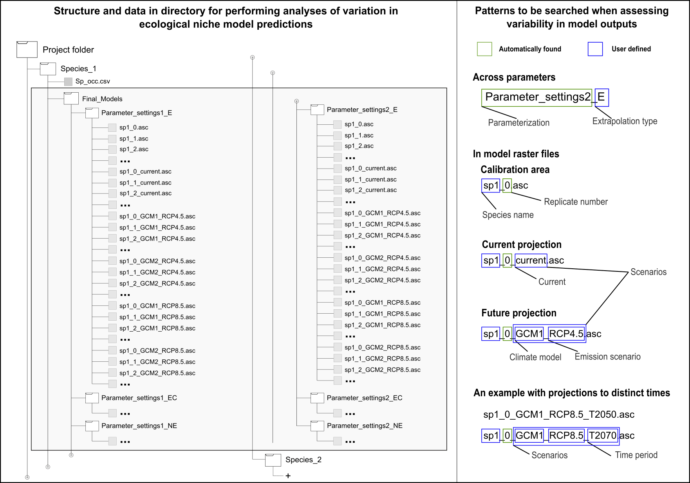

```{r setup, include = FALSE}
knitr::opts_chunk$set(
  collapse = TRUE,
  comment = "#>"
)
```

<br>

## Description

The set of tools presented here were created to help users in creating consensus and assessing levels of agreement among ecological niche models, as well as in evaluating variation in their outputs. Four main analyses can be performed: (1) calculation of model statistics across models (results from distinct parameter settings are allowed); (2) identification of changes of suitable areas and suitability in projections (considering multiple climate models, emission scenarios, and times); (3) creation of maps showing the variance contributed per each source of variation; (4) and hierarchical partitioning of the variance in models that comes from distinct sources of variation. The four potential sources of variation considered are: model replicates, parameter settings, GCMs, and RCPs.

<br>

## Data organization needed

All the analyses performed by the following functions use several raster outputs of ecological niche modeling analyses. Loading all those layers to the R environment won't be possible in most computers because of RAM limitations. That is why a specific organization of the data is needed. The structure of the directory containing the models is produced automatically when models are created with the <a href="https://github.com/marlonecobos/kuenm" target="_blank">kuenm R package</a>. See the figure below for details on the organization required.

```{r Fig.1, echo=FALSE, message=FALSE, warning=FALSE, fig.width=4, fig.cap="Figure 1. Directory structure and data for starting using the R functions for the assessment of variation in ecological niche model outputs. This figure represents models that were created using two distinct parameters settings and were projected to a bigger area in the current time and to future scenarios. Future conditions are represented by two climate models (GCM) in two emission scenarios (RCP). E, EC, and NE, represent three distinct options of extrapolation, free extrapolation, extrapolation and clamping, and no extrapolation, respectively."}


```

It is important to highlight that the functions in this repository can handle distinct situations of final models. This is, models could be created with no projections, however, if projected, models could be created with distinct options of extrapolation (Figure 1), or with only one of them. In addition, models can be created with only one set of parameters, but, if more parameter settings exist, functions will recognize them. To handle all of these situations the user will be asked for details about: species name, exitence of replicates, extrapolation types, general scenarios, climate models (GCM), emission scenarios (RCPs), and times of projection, the last five, only if model projections were performed. 

<br>

## How to use these functions 

The following lines will help users to load, prepare arguments, and use the functions to perform the analyses. After using each function check the working directory to see the outputs.

### Model statistics across multiple parameter settings

Function's help:

```{r, eval=FALSE, include=TRUE}
help(kuenm_modstats)
```

Preparing arguments:

```{r, eval=FALSE, include=TRUE}
sp_name <- "sp1"
fmod_dir <- "Final_Models"
format <- "asc"
project <- TRUE
stats <- c("med", "range")
rep <- TRUE
scenarios <- c("current", "GCM1_RCP4.5", "GCM1_RCP8.5", "GCM2_RCP4.5", "GCM2_RCP8.5")
ext_type <- c("E", "EC", "NE") # the type of extrapolation can be selected according to user requirements 
out_dir <- "Final_Model_Stats"

# argument "time.periods" is not included in the example but it can be used when models
# are projected to more than one time period, other than current.
```

The following lines will execute the function:

```{r, eval=FALSE, include=TRUE}
kuenm_modstats(sp.name = sp_name, fmod.dir = fmod_dir, format = format, project = project, 
               statistics = stats, replicated = rep, proj.scenarios = scenarios, 
               ext.type = ext_type, out.dir = out_dir)
```


### Changes of suitability and suitable areas between times

Note: This function is useful only when models were projected in time.

Function's help:

```{r, eval=FALSE, include=TRUE}
help(kuenm_projchanges)
```

Preparing arguments:

```{r, eval=FALSE, include=TRUE}
# other arguments were defined before
occ <- "Sp_occ.csv"
fmod_stats <- "Final_Model_Stats"
thres <- 5
curr <- "current"
emi_scenarios <- c("RCP4.5", "RCP8.5")
c_mods <- c("GCM1", "GCM2")
ext_type <- c("E", "EC", "NE")
out_dir1 <- "Projection_Changes"
```

The following lines will execute the function:

```{r, eval=FALSE, include=TRUE}
kuenm_projchanges(occ = occ, fmod.stats = fmod_stats, threshold = thres, current = curr, 
                  emi.scenarios = emi_scenarios, clim.models = c_mods, ext.type = ext_type, 
                  out.dir = out_dir1)
```


### Raster layers of variance coming from distinct sources

Function's help:

```{r, eval=FALSE, include=TRUE}
help(kuenm_modvar)
```

Preparing arguments:

```{r, eval=FALSE, include=TRUE}
sp_name <- "sp1"
fmod_dir <- "Final_Models"
rep <- TRUE
format <- "asc"
project <- TRUE
curr <- "current"
emi_scenarios <- c("RCP4.5", "RCP8.5")
c_mods <- c("GCM1", "GCM2")
ext_type <- c("E", "EC", "NE")
split <- 100
out_dir2 <- "Variation_from_sources"
```

The following lines will execute the function:

```{r, eval=FALSE, include=TRUE}
kuenm_modvar(sp.name = sp_name, fmod.dir = fmod_dir, replicated = rep, format = format,  
             project = project, current = curr, emi.scenarios = emi_scenarios, 
             clim.models = c_mods, ext.type = ext_type, split.length = split, out.dir = out_dir2)
```


### Hierarchical partitioning of the variance coming from distinct sources

Function's help:

```{r, eval=FALSE, include=TRUE}
help(kuenm_hierpart)
```

Preparing arguments:

```{r, eval=FALSE, include=TRUE}
sp_name <- "sp1"
fmod_dir <- "Final_Models"
rep <- TRUE
format <- "asc"
project <- TRUE
curr <- "current"
emi_scenarios <- c("RCP4.5", "RCP8.5")
c_mods <- c("GCM1", "GCM2")
ext_type <- c("E", "EC", "NE")
iter <- 100
s_size <- 1000
out_dir3 <- "Hierarchical_partitioning"
# argument "factors_col" is not defined here, but if default colors (grey scale) need to be changed, 
# you can use this argument.
```

The following lines will execute the function:

```{r, eval=FALSE, include=TRUE}
kuenm_hierpart(sp.name = sp_name, fmod.dir = fmod_dir, replicated = rep, format = format,  
               project = project, current = curr, emi.scenarios = emi_scenarios,    
               clim.models = c_mods, ext.type = ext_type, iterations = iter, 
               sample.size = s_size, out.dir = out_dir3)
```
